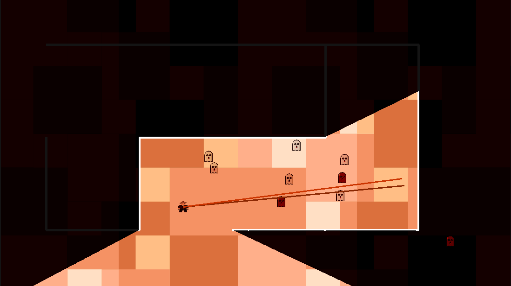

# museum ghosts, obviously 

a game of life and death

to play, simply install `pip install museumghosts` and run `museumghosts`!

You control the guard with `wasd` and shoot laser beams with mouse pointer!  Aim at the ghosts.

look: 👻

